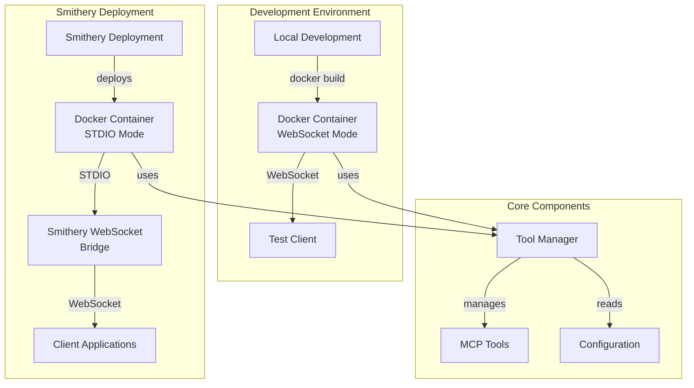
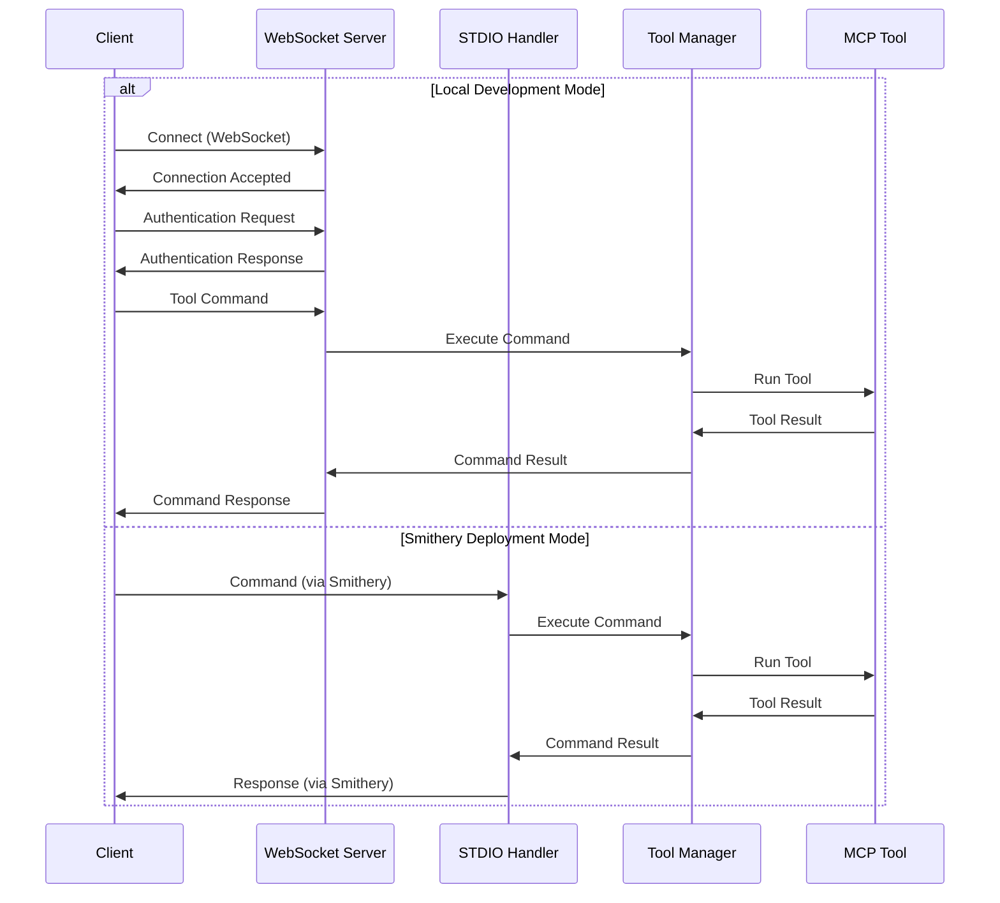
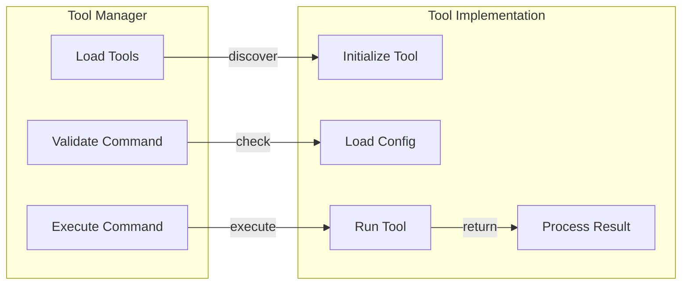
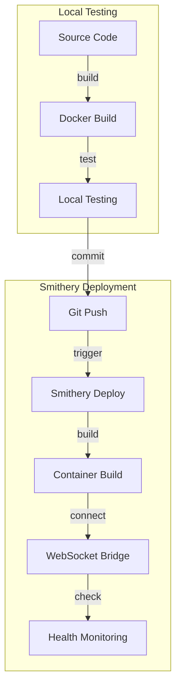
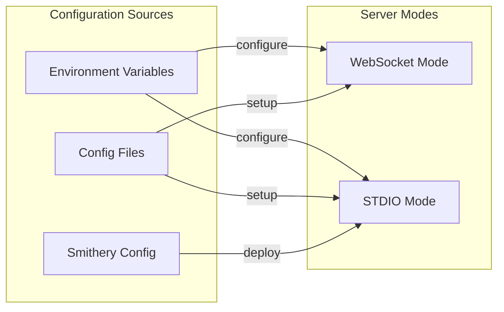

# Custom MCP Server Pipeline

## Architecture Overview

```mermaid
graph TB
    subgraph "Development Environment"
        LocalDev[Local Development]
        DockerLocal[Docker Container<br/>WebSocket Mode]
        TestClient[Test Client]
    end

    subgraph "Smithery Deployment"
        SmitheryDeploy[Smithery Deployment]
        DockerSmithery[Docker Container<br/>STDIO Mode]
        SmitheryWS[Smithery WebSocket<br/>Bridge]
        Clients[Client Applications]
    end

    subgraph "Core Components"
        ToolManager[Tool Manager]
        Tools[MCP Tools]
        Config[Configuration]
    end

    LocalDev -->|docker build| DockerLocal
    DockerLocal -->|WebSocket| TestClient
    DockerLocal -->|uses| ToolManager
    
    SmitheryDeploy -->|deploys| DockerSmithery
    DockerSmithery -->|STDIO| SmitheryWS
    SmitheryWS -->|WebSocket| Clients
    DockerSmithery -->|uses| ToolManager
    
    ToolManager -->|manages| Tools
    ToolManager -->|reads| Config
```

## Communication Flow

```mermaid
sequenceDiagram
    participant Client
    participant WS as WebSocket Server
    participant STDIO as STDIO Handler
    participant TM as Tool Manager
    participant Tool as MCP Tool

    alt Local Development Mode
        Client->>WS: Connect (WebSocket)
        WS->>Client: Connection Accepted
        Client->>WS: Authentication Request
        WS->>Client: Authentication Response
        Client->>WS: Tool Command
        WS->>TM: Execute Command
        TM->>Tool: Run Tool
        Tool->>TM: Tool Result
        TM->>WS: Command Result
        WS->>Client: Command Response
    else Smithery Deployment Mode
        Client->>STDIO: Command (via Smithery)
        STDIO->>TM: Execute Command
        TM->>Tool: Run Tool
        Tool->>TM: Tool Result
        TM->>STDIO: Command Result
        STDIO->>Client: Response (via Smithery)
    end
```

## Tool Execution Flow

```mermaid
graph LR
    subgraph "Tool Manager"
        LoadTools[Load Tools]
        ValidateCmd[Validate Command]
        ExecCmd[Execute Command]
    end

    subgraph "Tool Implementation"
        Init[Initialize Tool]
        Config[Load Config]
        Run[Run Tool]
        Result[Process Result]
    end

    LoadTools -->|discover| Init
    ValidateCmd -->|check| Config
    ExecCmd -->|execute| Run
    Run -->|return| Result
```

## Deployment Pipeline

```mermaid
graph TB
    subgraph "Local Testing"
        Code[Source Code]
        Build[Docker Build]
        Test[Local Testing]
    end

    subgraph "Smithery Deployment"
        Push[Git Push]
        Deploy[Smithery Deploy]
        Container[Container Build]
        Bridge[WebSocket Bridge]
        Monitor[Health Monitoring]
    end

    Code -->|build| Build
    Build -->|test| Test
    Test -->|commit| Push
    Push -->|trigger| Deploy
    Deploy -->|build| Container
    Container -->|connect| Bridge
    Bridge -->|check| Monitor
```

## Configuration Flow

```mermaid
graph LR
    subgraph "Configuration Sources"
        EnvVars[Environment Variables]
        ConfigFiles[Config Files]
        SmitheryConfig[Smithery Config]
    end

    subgraph "Server Modes"
        WSMode[WebSocket Mode]
        STDIOMode[STDIO Mode]
    end

    EnvVars -->|configure| WSMode
    EnvVars -->|configure| STDIOMode
    ConfigFiles -->|setup| WSMode
    ConfigFiles -->|setup| STDIOMode
    SmitheryConfig -->|deploy| STDIOMode
``` 